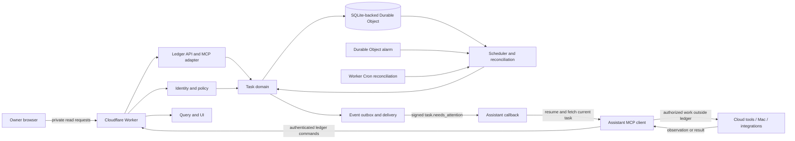
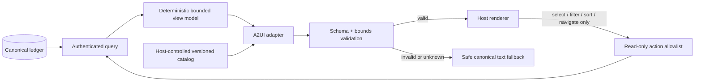

# flipp Work Ledger system design

> Current visual direction: the compact expandable list in [Variant A](../mockups/variant-a-ledger.html) supersedes earlier kanban layout requirements below. One row shows title and meaningful status; updates and next steps expand on demand, with evidence and history behind a second disclosure. Preserve canonical state, visible cancellation uncertainty, authorized query boundaries, and the separate full agent payload. Acceptance requires desktop/mobile rendering, no horizontal overflow, keyboard disclosure, filters, empty results, and reset. This revision changes presentation only; implementation gates remain NOT RUN.

Version 0.5 · 8 October 2026 · For review

## Status and intent

This document proposes a system design for the MVP described in the [PRD](PRD.md). It is not implementation, deployment, spending approval, or proof that the target assistant client supports the complete flow. All examples are synthetic.

The controlling release criteria are the stable IDs in the [constraint acceptance matrix](CONSTRAINTS.md). All are unimplemented and unverified at this design stage.

The design is deliberately a modular monolith: one Cloudflare Worker, one canonical SQLite-backed Durable Object for the initial owner, and internal modules with stable contracts. The assistant—not the ledger—chooses and operates cloud tools, a Mac environment, or other authorized integrations.

## Constraints carried into the design

- The ledger stores and coordinates task state; it does not execute external actions or manage execution environments.
- Runtime data is private and minimal. No inbox bodies, attachments, external-service credentials, signed source URLs, or real personal data belong in task records, logs, fixtures, or this public repository.
- One human owner and one primary assistant identity are enabled in v1. Agent IDs and task relationships exist so the model can evolve without enabling multi-agent execution now.
- One authoritative store owns state invariants. Events, browser views, and diagnostics are derived.
- Every mutation is versioned and idempotent. Claims are leased and fenced for ledger writes; they cannot lock or undo external actions.
- Cancellation, revocation, and scope changes are checked before every consequential ledger transition and separately by the assistant before an external action. An uncertain canceled action may be reconciled read-only but cannot reopen execution.
- Alarms, webhooks, and network calls are assumed to repeat, arrive late, arrive out of order, or fail permanently.
- An event is a prompt to fetch current state, never authority or proof of completion.
- Missed wakes, uncertain external results, and delivery failures must be visible and recoverable without blind replay.
- The architecture is free-tier-oriented, not guaranteed free. A monthly spending limit remains an owner decision.

### Proposed pilot envelope

These values bound design and synthetic load tests; they are not approved capacity or service-level commitments:

- one owner and one primary assistant identity;
- 100 open tasks, 10,000 retained tasks, and 100,000 audit entries;
- one mutation per second with a short burst of 10;
- a five-minute claim lease, with the same active run attempting renewal after roughly one minute;
- reconciliation every five minutes; and
- no hard guarantee for how quickly the assistant starts after an attention event.

Validate lease and renewal timing against real agent behavior during the connectivity pilot. Revisit limits, cost, storage, and reconciliation duration before admitting private task data.

## Constraint traceability

| Constraint | Primary design mechanism | Required proof in this document |
| --- | --- | --- |
| [C01](CONSTRAINTS.md#c01) | Component boundary, module allowlist, narrow MCP surface | Contract and integration boundary tests |
| [C02](CONSTRAINTS.md#c02) | Minimal entities, payloads, redacted logs, retention | Security/privacy scans and deletion tests |
| [C03](CONSTRAINTS.md#c03) | Separate ledger policy and assistant action-time checks | Authority, injection, provenance, and completion tests |
| [C04](CONSTRAINTS.md#c04) | Authenticated principals and owner-derived routing | Isolation, revocation, and identity-override tests |
| [C05](CONSTRAINTS.md#c05) | One transactional Durable Object store | Crash-boundary and projection-staleness tests |
| [C06](CONSTRAINTS.md#c06) | Versions, receipts, leases, fencing generations | Property, concurrency, replay, and stale-writer tests |
| [C07](CONSTRAINTS.md#c07) | Cancellation revisions and read-only reconciliation | Race and ambiguous-external-result tests |
| [C08](CONSTRAINTS.md#c08) | Scheduled jobs, alarms, reconciliation, visible diagnostics | Crash, exhaustion, poison, and repair tests |
| [C09](CONSTRAINTS.md#c09) | Minimal generated attention event and signed outbox delivery | Schema, duplicate, ordering, signature, and loop tests |
| [C10](CONSTRAINTS.md#c10) | Real-account synthetic connectivity gate | Signed event to intended conversation to current-task fetch |
| [C11](CONSTRAINTS.md#c11) | Restore quarantine plus external journal or verified manifest | Delete, restore, revoke, and no-resurrection tests |
| [C12](CONSTRAINTS.md#c12) | Modular monolith and versioned internal contracts | Dependency, compatibility, and migration tests |
| [C13](CONSTRAINTS.md#c13) | Revision-aware dependencies, provenance, joins, and fenced handoffs | Cycle, delegation, join, cancellation, and revocation tests |
| [C14](CONSTRAINTS.md#c14) | Narrow command allowlist and stable receipts and errors | Contract snapshots, malformed/unknown version, receipt tests |
| [C15](CONSTRAINTS.md#c15) | Proposed envelope, metrics, and owner-approved cap | Current pricing review, load test, and explicit approval |
| [C16](CONSTRAINTS.md#c16) | Canonical view model, host catalog, bounded read-only actions, safe fallback | Projection, payload, keyboard, responsive, and truth-preservation tests |

## Context and component design



The Worker terminates browser and MCP requests, authenticates the caller, and routes commands or queries. The Durable Object serializes authoritative mutations and persists the ledger. Its alarm processes the earliest due wake and outbox retry, then schedules the next. A periodic Cron-triggered reconciliation asks the same domain logic to repair missed or exhausted work.

The callback wakes the assistant. It never receives a task description, instruction, credential, or source content; it receives only an event and task reference. The assistant fetches current task state through authenticated MCP, chooses an available execution environment outside the ledger, and later records an observation, result, or blocker.

The proposed primitives follow current official documentation: remote MCP uses Streamable HTTP and can be stateless at the transport boundary; a Durable Object can keep application state; Durable Object alarms are at-least-once and have bounded automatic retries; and Cron Triggers provide a separate scheduled Worker entry point. These facts do not verify the end-to-end client integration. See [Cloudflare remote MCP](https://developers.cloudflare.com/agents/model-context-protocol/guides/remote-mcp-server/), [Durable Object alarms](https://developers.cloudflare.com/durable-objects/api/alarms/), and [Cron Triggers](https://developers.cloudflare.com/workers/configuration/cron-triggers/).

## Module boundaries

| Module | Owns | Must not own |
| --- | --- | --- |
| Task domain | States, transitions, scope revisions, completion rules, dependencies, claims, evidence metadata, audit facts | HTTP, callback delivery, browser rendering, external actions |
| Identity and policy | Principal mapping, owner isolation, ledger capability checks, delegation limits | External-service credentials, assistant action-time authorization |
| Scheduler and reconciliation | Eligibility, wakes, dependency release, claim expiry, join evaluation, repair scans | Business-state writes outside domain commands, arbitrary polling of external sources |
| Event outbox and delivery | Subscriptions, event creation, signing references, retries, delivery status | Treating delivery as task progress, task authority, external action execution |
| Ledger API and MCP adapter | Protocol validation, versioned command mapping, error contracts | Domain invariants, arbitrary network or machine-control tools |
| Query and UI | Owner views, filters, derived status summaries, accessibility | Authoritative mutations or a second task database |
| A2UI presentation adapter | Validated declarative surfaces from deterministic canonical view models | State inference, arbitrary code or styling, external actions, full client-data synchronization |

Calls cross modules through typed commands, results, and domain events. Contracts carry a schema version. Unknown major versions fail closed. Compatible minor additions are optional fields. Migrations update a recorded schema version and must have a tested rollback or forward-repair plan before deployment.

## Authoritative data model

Identifiers are opaque, random, and scoped to the owner. Timestamps are UTC instants; local schedules also retain the original IANA time zone and local expression.

| Entity | Essential fields | Notes |
| --- | --- | --- |
| `Principal` | `principal_id`, `owner_id`, `kind`, `status`, `capability_set_version` | Derived from authenticated context; request bodies cannot choose actor or owner |
| `Task` | `task_id`, `owner_id`, `parent_task_id`, `state`, `record_version`, `scope_revision`, `completion_revision`, `cancellation_revision`, `active_attempt_id`, `next_action`, timestamps | Canonical current state |
| `ScopeRevision` | `task_id`, scope and completion revisions, allowed action classes and destinations, limits, completion condition, approval reference, created by and at | Reference only; no copied conversation or secret |
| `Attempt` | `attempt_id`, `task_id`, `run_id`, `agent_id`, `status`, `fencing_generation`, `lease_expires_at`, scope, completion, and cancellation revisions, start and finish timestamps | Contains ledger claim ownership; does not control external execution |
| `Observation` | `observation_id`, `task_id`, `attempt_id`, kind, redacted summary, evidence reference, observed at, author principal, accepted scope and completion revisions | Includes facts, blockers, completion proof, and uncertain outcomes; no signed URL or source-body copy |
| `Dependency` | `task_id`, `depends_on_task_id`, `required_state`, `status` | Reject cycles; parent joins require accepted proof from required children |
| `ScheduledJob` | `job_id`, `task_id`, kind, `due_at`, status, `job_generation`, `attention_generation` | Durable wake or reminder record; job generation invalidates stale jobs |
| `OutboxDelivery` | `event_id`, `task_id`, task and attention generations, name, minimal payload, attempt count, next attempt, status | Written atomically with the state fact that caused it |
| `Subscription` | `subscription_id`, owner, event name, filter, callback URL, protected secret reference, expiry, status | Signing secret resides in protected infrastructure storage |
| `MutationReceipt` | principal, operation, idempotency key, canonical input hash, result or error reference, created and expiry timestamps | Same key plus different input is an error; retention remains a decision |
| `AuditEntry` | sequence, task ID, actor, operation, versions before and after, changed field names, result reference, timestamp | Append-only logical history with minimized content |
| `SchemaMigration` | version, checksum, applied at, compatibility status | Prevents unknown writers and silent drift |

## State and ownership invariants

1. A task has exactly one owner and never changes owners in v1.
2. A task has at most one unexpired active claim. An ordinary renewal by the same active run keeps its fencing generation; replacement, reassignment, or expiry recovery receives a monotonically newer generation.
3. A mutation supplies the expected `record_version`; success increments it exactly once.
4. An idempotency key identifies one logical operation for one principal. Same key and input returns the stored result; same key and different input fails.
5. A result is accepted into ledger state only from the active run with the current fencing generation plus scope, completion, and cancellation revisions. This rule does not prevent or reverse an external action.
6. `Completed` requires a satisfied completion rule and attributable evidence consistent with the current scope and completion revisions. The assistant verifies the real-world outcome and applicable authority; the ledger validates structure, attribution, revision consistency, and the state transition. An event, claim, acknowledgment, or worker response alone is insufficient.
7. `Canceled` and `Completed` are terminal. Reopening creates a new recorded instruction and scope revision rather than mutating terminal history.
8. Cancellation increments its revision, invalidates wakes and claims, and prevents new attempts. It does not assert that an in-flight external action was undone. Read-only reconciliation may record the observed or uncertain result but cannot reopen execution.
9. Every nonterminal waiting task has a future wake, an active event subscription, or an explicit visible reason that no check can occur.
10. Every outbox delivery refers to a committed task version. Delivery cannot change task state directly.
11. Event payloads contain identifiers and reasons only; consumers must fetch current state.
12. Dependency writes reject direct and transitive cycles. Parent completion evaluates a revision-aware join rule and accepted proof from required subtasks. Future delegation cannot widen parent authority.
13. Scope and completion rules are immutable revisions. A completion observation states which revisions it satisfies; a later revision cannot inherit completion silently.
14. Actor and owner come from authenticated server context. Caller-supplied identity fields are absent or rejected.

## Task state transitions

```mermaid
stateDiagram-v2
    [*] --> Queued: create
    Queued --> Running: valid claim + attempt start
    Queued --> Blocked: missing authority or capability
    Queued --> Canceled: cancel
    Running --> WaitingExternally: observation requires later check
    Running --> Blocked: decision, access, or uncertain outcome
    Running --> Completed: completion rule + verified evidence
    Running --> Canceled: cancel; preserve in-flight uncertainty
    WaitingExternally --> Queued: due wake or relevant event
    WaitingExternally --> Blocked: check cannot proceed
    WaitingExternally --> Canceled: cancel
    Blocked --> Queued: new scope or blocker resolved
    Blocked --> Canceled: cancel
```

Claim expiry does not invent an external outcome. Reconciliation marks the attempt stale, releases ledger ownership with a newer fencing generation, and returns the task to Queued or Blocked only when current scope and external uncertainty make further execution safe. A canceled task remains Canceled; read-only reconciliation may append an observation but cannot make it executable again.

## Versioned MCP and query surface

The MCP server exposes ledger operations only. Each mutation request contains `contract_version`, `idempotency_key`, `canonical_input_hash`, and `expected_record_version`. Claim-bound writes also contain `run_id` and `fencing_generation`. The server derives actor and owner from authenticated context, recomputes the canonical hash, and returns a durable mutation receipt. Receipt retention is an open decision.

| Operation | Purpose | Important result or failure |
| --- | --- | --- |
| `tasks.list` | Filter owner-visible tasks by state, due window, or update cursor | Stable pagination and evidence age |
| `tasks.read` | Fetch canonical task, current scope, claim summary, dependencies, and recent history | Not found and unauthorized are not distinguishable across owners |
| `tasks.audit_list` | Read minimized chronological history | Stable sequence cursor |
| `tasks.create` | Record approved work and completion condition | Created version or idempotent prior receipt |
| `tasks.revise_scope` | Add a referenced scope and completion revision | Reject stale version, cycles, or unsupported authority expansion |
| `tasks.claim` | Atomically claim eligible work | Run ID, lease expiry, fencing generation, current task version |
| `tasks.renew` | Extend the same active run | Same fencing generation and a later lease; reject stale owner |
| `tasks.start` | Record that the claimed assistant attempt actually began | Separate start milestone; no claim-only inference |
| `tasks.observe` | Append an attributed fact or uncertain external result | Validate structure, revisions, provenance, and active fencing |
| `tasks.wait` | Record a named dependency and scheduled job or subscription | Reject an indefinite wait with no visible plan or reason |
| `tasks.block` | Record a decision, access, capability, or uncertainty blocker | Typed reason and next step |
| `tasks.complete` | Accept revision-consistent proof and transition to Completed | Ledger validates proof presence and attribution, not external truth |
| `tasks.cancel` | Stop future ledger work | New cancellation revision and invalidated jobs and claims |
| `tasks.reconcile_readonly` | Append a post-cancel or uncertain observation without enabling work | Cannot claim, start, queue, or reopen a task |

Queries return canonical version numbers and `observed_at` separately from response time. The UI shows evidence age, stale claims, due or missed checks, and delivery health explicitly. Read endpoints may use derived projections for speed, but a projection exposes its source sequence and cannot answer as current if it is behind the requested version.

### Deterministic presentation model

The [PRD payload contract](PRD.md#agent-and-human-payload-contract) is normative for field names, types, required/null semantics, and view allowlists. Agent queries return the coordination record in a versioned envelope; card/board and Details queries return their distinct human projections. All derive from one authorized canonical snapshot. Event bodies remain the separate minimal notification contract. Server modules own returned facts; no caller chooses owner or actor.

The server must validate the requested view against authenticated owner and principal access, use explicit projection allowlists, and never send the agent record to the browser for client-side hiding. Unknown major versions, missing required fields, stale requested versions, and mismatched scope/fencing revisions fail as specified in the PRD. Cached card and Details versions must match. The synthetic example is contract documentation only; it is not an endpoint or proof of compatibility.

The query layer builds one bounded, deterministic `TaskPresentation` projection before any conventional template or generated UI adapter runs. It contains canonical state, explicit qualifiers, next action, scope summary, evidence references and observation times, page projection time, dependency summaries, and chronological audit items. It never contains source bodies, credentials, signed URLs, contact records, execution-environment discovery, or arbitrary instructions.

The selected human renderer is a kanban board, replacing the prior continuous-list baseline. Its six column keys are exactly Queued, Running, Waiting externally, Blocked, Completed, and Canceled. The card projection's required `canonical_state` determines grouping; no new backend board state or independent position store exists. Diagnostic qualifiers remain on the card in its actual column. Filtered empty columns keep their headings and counts. Invalid/unknown state cannot be assigned a guessed column.

The board is read-mostly: filter, search, state-jump, reset, and Details are presentation controls. No drag/drop status or order writes exist. Chat-coordinated state changes still use authorized narrow domain commands with version/fencing checks. Desktop columns wrap only for readability; mobile stacks the same sections and uses focus-preserving state navigation. A2UI may compose approved board/column/card/disclosure components but may not alter canonical placement, suppress warnings, or return agent-only metadata.

The same task version and catalog version produce the same semantic view model. A renderer may change layout across viewport sizes, but it cannot relabel state, discard an active blocker, promote stale evidence, infer connectivity, or manufacture a completion. If a projection is stale, the view declares its source task version and projection time.

Expose separate authenticated query contracts for agents and humans. The agent coordination payload includes revisions, approval references, claims and ownership, dependency state, due/check times, action constraints, evidence references, delivery health, and audit sequence. Unknown fields remain explicitly unknown. The human projection contains canonical_state for board grouping, a concise title, truthful status summary, next step, material warning, and optional evidence details. Both derive from the same canonical record. Do not ship the private agent payload to the browser or embed it in A2UI data or action context. Public prototype fixtures remain synthetic.

The deterministic surface-selection and state-progression policy is defined in [Agent-driven UI experience](AGENT_UI_EXPERIENCE.md). It chooses among stable Needs attention, Progressing, and Waiting lenses from canonical fields; it does not give a model open-ended authority to decide urgency or rewrite the page structure.

### Proposed A2UI adapter

A2UI is a future presentation adapter, not part of canonical state, task execution, or the wake path. As of this review, the official project identifies v0.9.1 as current production and v1.0 as a candidate; the original announcement's v0.8 is legacy. Implementation must pin an exact supported protocol and catalog version after the connectivity and UI gates. [A2UI](https://a2ui.org/) · [v0.9.1 specification](https://a2ui.org/specification/v0.9.1-a2ui/)



The catalog is owned by the host and mirrors the ledger design system. Initial components cover text, state labels, human metadata, board columns/cards, disclosure groups, timelines, filter controls, navigation, warnings, and safe fallback. Generated surfaces cannot import arbitrary HTML, JavaScript, CSS, external code, or ad hoc renderer functions. [A2UI catalogs](https://a2ui.org/concepts/catalogs/)

Validate protocol and catalog versions, schema, component references, action names, data types, enum values, depth, total nodes, collection lengths, string lengths, and total payload bytes before rendering. Validate again in the client and degrade to the canonical text fallback on error. Do not permit a validation error to hide the task's state, blocker, uncertainty, or freshness.

V1 actions are `select_task`, `set_filter`, `reset_filters`, `set_sort`, and `navigate_view`. Context includes only the minimum opaque IDs or enumerated values needed for that action. No action maps to claim, start, complete, cancel, retry, approve, revise scope, choose an environment, or execute work. Keep `sendDataModel: false`; the adapter never sends the entire client model back to the agent. [A2UI actions](https://a2ui.org/concepts/actions/)

MCP Events continues to wake the assistant. After a wake or owner request, the client performs an authenticated canonical fetch and may render the resulting projection conventionally or through the adapter. A2UI delivery is not evidence of event receipt, task fetch, start, progress, or completion.

Error responses are stable, typed, and non-secret: `validation_failed`, `unauthorized`, `version_conflict`, `idempotency_conflict`, `not_eligible`, `stale_claim`, `canceled`, `completion_not_satisfied`, `dependency_cycle`, and `temporarily_unavailable`. Retried requests return the recorded receipt, including the same stable error when applicable. Responses do not reveal another owner's resource existence, credential state, internal stack, or source content.

## Wake, outbox, and event delivery

### Commit path

1. A domain command validates identity, scope, expected version, idempotency key, and claim fencing.
2. One Durable Object storage transaction writes the task change, audit entry, scheduled-job changes, mutation receipt, and any outbox delivery.
3. After commit, the scheduler sets the Durable Object's single alarm to the earliest pending wake or delivery retry. All later times remain persisted in the ledger.
4. A failed request can be repeated with the same idempotency key without applying the mutation twice.

### Alarm path

1. On alarm, read due wakes and outbox items in a bounded batch.
2. Revalidate task version, cancellation revision, job generation, subscription status, and due time.
3. For a task wake, transition eligible state and create at most one `task.needs_attention` outbox fact.
4. For delivery, send the existing event ID with a fresh signing timestamp and signature.
5. Persist success, retry, or terminal failure, then schedule the next earliest pending time.

Cloudflare documents one active alarm per Durable Object and at-least-once execution with bounded automatic retries. Therefore the schedule lives in storage, alarm handlers are idempotent, and code explicitly reschedules remaining work. The design never depends on an alarm running only once.

### MCP Events path

The proposed event contract uses MCP Events on the same authenticated remote MCP endpoint: `events/list`, `events/subscribe`, and `events/unsubscribe`. Subscription creation is idempotent and authorized. Callback verification and delivery use HTTPS, validated public destinations, no redirects, and protected signing secrets. [OpenAI MCP Events](https://developers.openai.com/plugins/build/mcp-events)

`task.needs_attention` carries only a schema version, stable event ID, task ID, task version, attention generation, and enumerated reason. It contains no title, source URL, free-form instruction, or private task text:

```json
{
  "schemaVersion": 1,
  "eventId": "evt_synthetic",
  "name": "task.needs_attention",
  "timestamp": "2030-01-01T12:00:00Z",
  "data": {
    "taskId": "task_synthetic",
    "taskVersion": 7,
    "attentionGeneration": 3,
    "reason": "scheduled_check_due"
  }
}
```

A `2xx` acknowledges callback receipt only. Delivery state, assistant fetch, claim, attempt start, and task completion remain separate facts. Event retries for the same attention generation preserve the event ID; out-of-order or duplicate events cause a current-state read and no duplicate mutation. Reads, heartbeats, claim renewals, and routine progress do not create new attention generations. Later reminders require a bounded, separately approved reminder policy. Revoked or expired subscriptions stop delivery. WebMCP is not part of the wake path.

The initial reason enum is `task_became_eligible`, `scheduled_check_due`, `dependency_resolved`, or `delivery_recovered`. Adding `reminder_due` requires approval of the reminder policy and a contract-version-compatible schema change.

### Cron reconciliation

A low-frequency Cron Trigger performs bounded repair, not normal execution. It asks the canonical store to find:

- due wakes without a scheduled alarm;
- alarms or outbox deliveries whose retry window was exhausted;
- expired claims still shown as Running;
- delivered events with no subsequent task check recorded after a review threshold;
- canceled tasks with active wakes or claims;
- expired or revoked subscriptions still marked active;
- retention work that is overdue.

Repairs use the same domain commands, version checks, and idempotency rules as ordinary paths. Reconciliation never repeats an external action. It records what it repaired and surfaces anything it cannot resolve. The UI says “no subsequent task check recorded”; it does not infer whether a Mac, cloud runtime, or network connection is online.

## Authentication and authorization boundaries

| Boundary | Proposed control | Explicit non-goal |
| --- | --- | --- |
| Owner browser to Worker | Private interactive authentication, owner binding, secure session, CSRF protection where applicable | Sharing or multi-owner access in v1 |
| Assistant to MCP | Separate assistant principal, authenticated Streamable HTTP, narrow ledger scopes, revocation | External-service access or permission self-granting |
| Worker to Durable Object | Private binding and owner-derived object identity | Public direct Durable Object endpoint |
| Ledger to callback | Verified HTTPS destination, protected subscription signing secret, signed body, bounded retry | Treating callback content as authority |
| Assistant to external tools | Existing assistant-side authentication and action-time checks | Ledger credential custody, desktop connection, tool discovery, or action execution |

Authorization evaluates principal, owner, operation, task scope revision, requested transition, and capability-set version. A policy decision is logged by reference and reason code, not by copying tokens or private policy inputs. Revocation blocks new commands and events; reconciliation invalidates affected claims and subscriptions.

The ledger may hold its own browser-authentication secrets and MCP event-signing secrets in protected infrastructure storage. It must not hold credentials for email, calendars, desktops, cloud developer tools, or other services used by the assistant to perform external work.

## Security and privacy controls

- Validate every protocol payload against a closed schema with size, type, and length limits.
- Use opaque identifiers and owner-scoped lookups; avoid sequential public IDs.
- Reject callback destinations resolving to local, private, link-local, or otherwise disallowed networks; do not follow redirects.
- Keep event signing secrets and application secrets in protected infrastructure storage. Store only opaque secret references in ledger records.
- Redact authentication headers, cookies, callback secrets, signed URLs, task text, and source references from operational logs.
- Apply per-principal and per-operation rate limits, plus tighter limits on subscription and delivery endpoints.
- Use a restrictive content security policy, secure cookies, origin checks, and output encoding for the owner UI.
- Treat task text, event data, evidence summaries, source content, and delegated results as untrusted data, never executable instructions.
- Separate production, test, and local data. Use synthetic fixtures and never copy production records into development.
- Record security-relevant changes in minimized audit entries and make audit deletion follow an approved retention policy.

## Retention and deletion

The PRD's proposed 90-day completed-task retention and 30-day diagnostic retention remain unapproved defaults. Before storing private data, define and test:

- deletion across tasks, evidence references, audit entries, wakes, outbox items, subscriptions, projections, and backups;
- the maximum backup lifetime and restore procedure;
- tombstones needed to prevent a restore from reviving canceled work, deleted records, or revoked subscriptions;
- export format and owner access;
- how an active legal, security, or recovery hold would be authorized and surfaced, if such a feature is needed.

Cloudflare currently documents that SQLite-backed Durable Objects support point-in-time recovery to a point within the past 30 days. Primary-store deletion therefore does not mean that all recoverable copies disappear immediately. Owner-facing deletion promises must name the recoverability window and distinguish inaccessible primary data from data that remains recoverable under platform backup behavior. [Durable Object storage and point-in-time recovery](https://developers.cloudflare.com/durable-objects/best-practices/access-durable-objects-storage/)

Deletion first disables wakes, claims, and subscriptions. A tombstone stored only inside the restored snapshot cannot prevent its own resurrection. Before launch, choose either a minimized external control journal outside the restored store or a verified restoration procedure supplied with an authoritative deletion and revocation manifest. In either design, a restore starts with claims, alarms, subscriptions, and delivery disabled, then runs migrations plus cancellation, deletion, and revocation reconciliation before normal scheduling can be enabled.

## Observability and operating limits

Use structured, redacted metrics rather than task-content logs. Minimum measures are command latency and errors, version conflicts, claim age, wake lateness, alarm retry count, reconciliation repairs, outbox age, delivery attempts, subscription expiry, callback-to-fetch delay, uncertain outcomes, and completed tasks lacking valid evidence.

Set alerts only after a synthetic baseline. Proposed alert classes are missed-wake risk, delivery backlog, repeated authorization failures, migration failure, and storage or CPU use approaching an approved limit. The UI should show owner-relevant failures even if an operational alert also fires.

The cost posture is to minimize periodic work, batch due items, keep one canonical store, avoid extra services, and use alarms only when work exists. Current Cloudflare pricing and limits must be checked again during implementation planning. No paid plan, usage target, or monthly budget is approved by this design. [Cloudflare Workers pricing](https://developers.cloudflare.com/workers/platform/pricing/)

## Test plan and release gates

### Domain and contract tests

- **[C01](CONSTRAINTS.md#c01), [C06](CONSTRAINTS.md#c06), [C14](CONSTRAINTS.md#c14):** Exhaustively test allowed and rejected state transitions, the narrow command allowlist, and absence of execution or machine-control tools.
- **[C06](CONSTRAINTS.md#c06), [C13](CONSTRAINTS.md#c13), [C14](CONSTRAINTS.md#c14):** Use property-based tests for transition invariants, dependency acyclicity, revision-aware completion, and idempotent receipts.
- **[C06](CONSTRAINTS.md#c06):** Race two claims and prove one active fenced owner; replay every mutation with identical and conflicting idempotency inputs.
- **[C03](CONSTRAINTS.md#c03), [C06](CONSTRAINTS.md#c06), [C14](CONSTRAINTS.md#c14):** Attempt writes with stale record, scope, completion, cancellation, claim, and contract revisions.
- **[C03](CONSTRAINTS.md#c03), [C13](CONSTRAINTS.md#c13):** Verify completion, parent joins, and future delegation never widen authority.
- **[C05](CONSTRAINTS.md#c05), [C12](CONSTRAINTS.md#c12), [C14](CONSTRAINTS.md#c14):** Run transactional-boundary, projection-staleness, forward-migration, compatibility-window, rollback or forward-repair, and unknown-writer tests.

### Scheduling and recovery tests

- **[C06](CONSTRAINTS.md#c06), [C08](CONSTRAINTS.md#c08):** Fire the same alarm repeatedly and out of order; crash before and after each transactional boundary.
- **[C08](CONSTRAINTS.md#c08):** Exhaust alarm and delivery retries, then prove Cron reconciliation surfaces and repairs only eligible ledger work.
- **[C06](CONSTRAINTS.md#c06), [C08](CONSTRAINTS.md#c08), [C09](CONSTRAINTS.md#c09):** Exercise duplicate, out-of-order, expired-subscription, and poison delivery cases without task-state corruption or unbounded retries.
- **[C08](CONSTRAINTS.md#c08):** Cross daylight-saving gaps and folds while preserving the recorded local intent.
- **[C07](CONSTRAINTS.md#c07):** Cancel during claim, delivery, callback receipt, and uncertain external outcome; prove an expired claim is not proof that an external action failed and an unknown result blocks blind retry.
- **[C11](CONSTRAINTS.md#c11):** Restore a backup and prove canceled, deleted, and revoked work does not resume.
- **[C15](CONSTRAINTS.md#c15):** Test the proposed pilot limits and a bounded overload response without asserting a production performance target.

### Security and privacy tests

- **[C03](CONSTRAINTS.md#c03), [C04](CONSTRAINTS.md#c04):** Reject wrong-owner, anonymous, revoked, over-scoped, enumeration, and caller-identity override attempts.
- **[C09](CONSTRAINTS.md#c09):** Reject callback redirects and private or local network destinations; test signatures, replay windows, key rotation, subscription expiry, and rate limits.
- **[C02](CONSTRAINTS.md#c02):** Verify secrets and private source content are absent from records, logs, errors, events, public assets, and fixtures.
- **[C03](CONSTRAINTS.md#c03), [C09](CONSTRAINTS.md#c09):** Inject instructions into task text and event data and verify they cannot change policy or tool scope.
- **[C16](CONSTRAINTS.md#c16):** Fuzz A2UI payloads and enforce catalog/version, depth, count, length, enum, action, and byte bounds; invalid content must render a safe canonical fallback.
- **[C02](CONSTRAINTS.md#c02), [C16](CONSTRAINTS.md#c16):** Prove UI payloads and action contexts contain no credentials, source bodies, signed URLs, private contacts, or full client data model.

### Presentation verification

- **[C16](CONSTRAINTS.md#c16):** Compare conventional and generated views against golden canonical projections for every state and qualifier, including blocked, expired claim, missed check, and uncertain canceled outcome.
- **[C08](CONSTRAINTS.md#c08), [C16](CONSTRAINTS.md#c16):** Verify evidence observation time, page projection time, stale state, and “no subsequent task check recorded” remain distinct and visible.
- **[C16](CONSTRAINTS.md#c16):** Test default, filtered, selected, reset, empty, fallback, desktop, and mobile states; verify keyboard order, visible focus, semantic headings, no clipping, and no hover-only evidence.

### Synthetic connectivity gate

**[C04](CONSTRAINTS.md#c04), [C09](CONSTRAINTS.md#c09), [C10](CONSTRAINTS.md#c10):** Before building the full application, prove with real account authentication and synthetic task data that the intended client can connect to a private remote MCP server, expose these ledger tools and MCP Events, create and refresh a subscription, verify a signed callback, deliver `task.needs_attention` into the intended conversation, resume that assistant context, fetch the correct current task, and stop after unsubscribe or revocation. Repeat after reconnect and server restart.

This gate is not passed by documentation, a local inspector, or a callback `2xx`. Failure stops the full build and returns the architecture for review.

## Delivery sequence

1. Approve constraints, owner experience, retention direction, authentication approach, and a monthly spending cap.
2. Write executable domain and contract tests with an in-memory or local synthetic store.
3. Implement only enough authenticated remote MCP and MCP Events behavior to run the synthetic connectivity gate.
4. If the gate passes, implement the canonical state machine, fenced claims, transactional outbox, alarms, and reconciliation.
5. Add the private query UI and accessibility checks.
6. Complete security, privacy, restore, revocation, and retention tests.
7. Run a synthetic pilot, establish operating baselines, and request separate approval before admitting real task data.

## Tradeoffs

| Choice | Benefit | Cost or risk | Review trigger |
| --- | --- | --- | --- |
| One Durable Object per owner | Serialized mutations and one source of truth | Per-owner hotspot and platform coupling | Measured load or storage exceeds tested limits |
| Modular monolith | Simple deployment and transactions | Internal boundaries require discipline | Need for independent scaling or stronger isolation |
| Alarm plus Cron reconciliation | Precise wakes with a repair path | Two scheduling entry points to test | Persistent lateness or repair load |
| Minimal event payload | Lower privacy risk and stale-data risk | Requires a follow-up read | Client cannot reliably fetch after wake |
| Read-mostly owner UI | Keeps chat as decision surface | No direct cancel or correction | Owner intervention latency is unacceptable |
| References instead of copied sources | Minimizes retained private data | Links may expire or access may disappear | Evidence cannot be verified reliably |
| Future-ready agent fields | Avoids disruptive redesign | Some unused v1 schema | Complexity impairs v1 correctness |

Do not add D1, Queues, Workflows, multiple Durable Objects per owner, or a service split preemptively. If a review trigger fires, write an architecture decision record comparing measured evidence, migration safety, cost, and rollback.

## Open decisions

- What monthly spending cap and alert threshold should govern the private pilot?
- Which interactive authentication method should protect the owner UI?
- Which authentication and narrow scopes should identify the assistant MCP principal, and how is revocation tested?
- Are the proposed five-minute claim lease, one-minute renewal point, five-minute reconciliation interval, and pilot data and mutation limits compatible with actual agent behavior and acceptable cost?
- Are the proposed 90-day task and 30-day diagnostic retention periods acceptable, and what is the backup maximum?
- Should the owner UI remain strictly read-only, or expose a narrowly scoped cancel action after v1?
- Does `task.needs_attention` need replay, or should missed non-replay events rely only on reconciliation and current-state reads?
- Which synthetic tasks cover waits, cancellation races, uncertain outcomes, scope changes, reconnects, and daylight-saving behavior?
- What measured condition would justify extracting a module or adding another Cloudflare product?
- Before multi-agent enablement, who may delegate, reassign, accept results, or approve completion, and how are per-agent capabilities and context isolation administered?
- How long should mutation receipts remain available for safe client retries?
